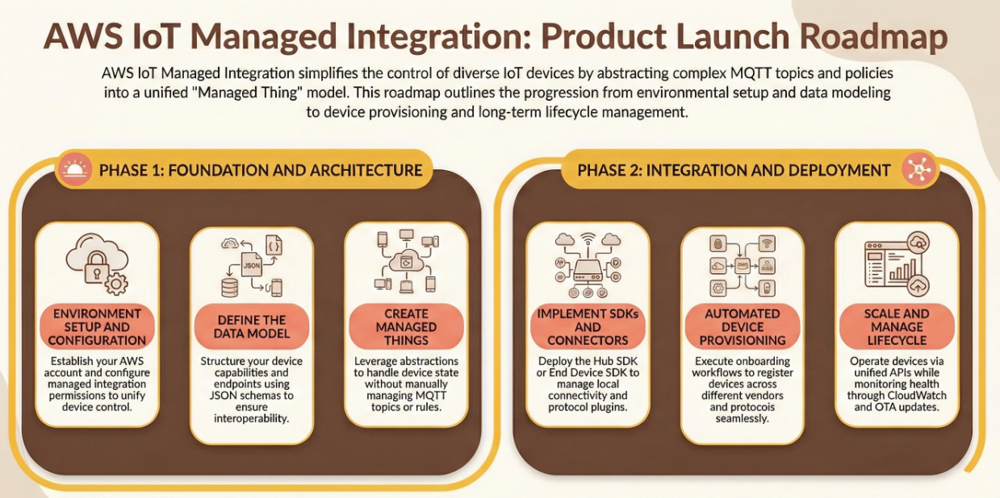
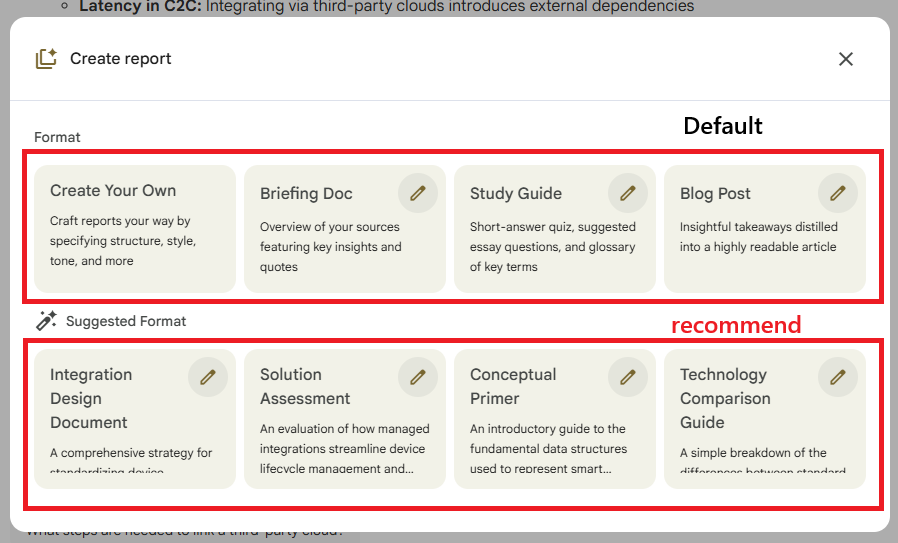
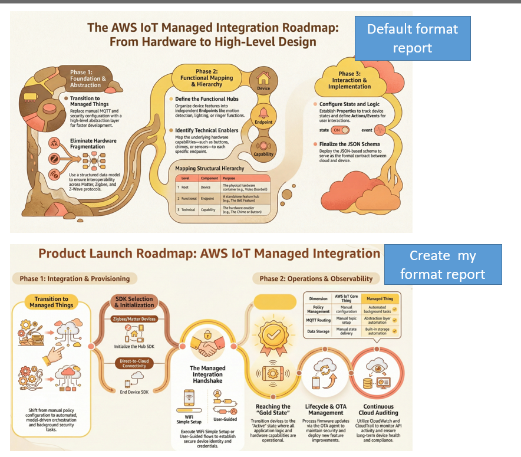
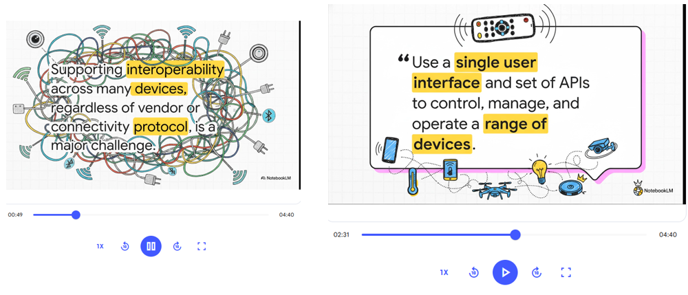
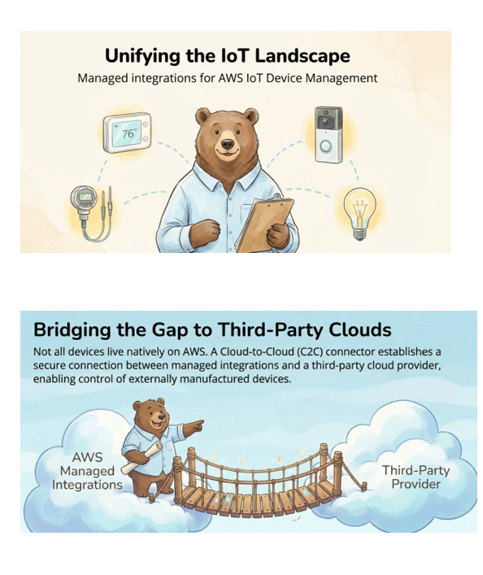

# NotebookLM Prompt and Note

## Type of Studio Case 

### Case1: Generate Report and Infographic

Objective: Learn step to generate Report and inforgraphic 
1. import Reference source: 
2. go to gemini to write me prompt base on this format
Please noted I used base on my personal background, so please change your own background
```
please give me a notebookLM's prompt base of this style Role, Tone,Context, Format preferences. 
// I use the video's prompt and paste in here, it will skip the prompt if you're interested you watch the soruce video 
//i just wish to help me format in that way
my background: Telecommunication industry, FAE engineer, product: Network devices like gw, mesh, wifi, cable, etc
Source detail: Amazon IoT website https://docs.aws.amazon.com/iot-mi/latest/devguide/what-is-managedintegrations.html
```
3. Access to NotebookLm import the source which is the link above 
4. On chat and select Custom and write prompt as below:
```
Role: Senior Technical Solutions Architect & FAE Lead (Telecommunications)
Tone: Technical, precise, analytical, and troubleshooting-oriented. Avoid fluff; focus on engineering feasibility.
Context: This notebook contains technical documentation for AWS IoT Managed Integrations. I am using this to evaluate how to integrate our telecommunications hardware (Gateways, Mesh systems, WiFi APs, and Cable modems) with the AWS IoT ecosystem. The goal is to streamline device provisioning, management, and cloud connectivity for our ISP and enterprise customers.
When responding:
Prioritize Hardware/Software Interfacing: Focus on how the AWS Managed Integrations interact with device firmware, SDKs, and local networking protocols.
Security & Scalability First: Always highlight security requirements (certificates, authentication) and how the solution scales for a fleet of millions of devices.
Identify Dependencies: Explicitly state what hardware resources (memory, CPU, OS) or external libraries are required based on the documentation.
Bridge the Gap: Translate cloud-centric AWS concepts into "Telecom-speak" (e.g., relating IoT management to TR-069, OMCI, or Matter standards where applicable).
Technical Red Flags: Proactively point out limitations in the AWS documentation that might affect low-latency mesh networking or high-throughput gateway performance.
Format preferences:
Use nested bullet points for technical breakdowns.
Use code blocks for any CLI commands, API calls, or schema examples found in the text.
Bold critical technical requirements or constraints.
Include a "Implementation Impact" section at the end of long responses summarizing how this affects the hardware design cycle.
```
5. ask it something (optional)
```
What is the keynote to this topic
```
6. Generate infographic report
Click inforgraphic on studio and custom the prompt like below
```
Generate a timeline infographic about "Product Launch Roadmap" for AWS IoT Managed Integration
Style: Clean, warm, and natural aesthetic matching the AWS brand
Color palette: Sunny yellow (#F7B32B), warm brown (#5D4037), soft coral accents
Horizontal timeline with key milestones
Rounded, friendly shapes
```


7. Generate report 
Click report on studio and click suggest format which give you some recommend idea. 



You can also create your own report format like:
```
Create a standard operating procedure (SOP) for integrating and troubleshooting a new network device (e.g., Gateway or Mesh node) using AWS IoT Managed Integrations.

Include:
- Device Provisioning & Logging: How to initiate the "Managed Integration" handshake, including the specific logs to monitor (BLE, WiFi, or CloudWatch) during the initial pairing.
- Categorizing Integration States: Create a classification system for device status based on the AWS documentation (e.g., Provisioning, Active, Disconnected, or OTA Update Pending).
- Escalation Matrix: Define the specific technical triggers (e.g., Repeated $403$ Forbidden errors, MQTT heartbeat timeouts, or certificate mismatch) that require escalation from the FAE to the AWS Backend or Firmware R&D teams.

Format with numbered steps.

Create a Client Feedback Integration Process SOP for Simple Mills. Include: how to log feedback, how to categorize it, and when to escalate. Format with numbered steps.
```

8. Add report as source and click inforgraphic again(prompt is same as previous used)
You need to `export to docs` the report and then import it into source

Let see the Infographic generate for both report it generate (one is default format, one my own format)



Source: `@graceleungyl`

### Case2: Training workshop via video overview
1. import source 
2. on chat use this prompt to design and outline of inernal training
```
Design a 1-hour internal training workshop on AWS IoT Managed Integration for FAE Engineer and Software QA Engineer with minimal AWS experience and no coding experience. Including objectives and a comprehensive lesson breakdown
```
3. pick one outline and and copy (ex: introduction)
4. Click on video overview click custom and paste you jsut copy outline 
- Describe a custom visual style 
```
Science textbook illustration style with hand-drawn diagrams or drawing , and warm lighting
```
- What should the AI focus on?
```
Audience:  FAE Engineer and Software QA Engineer with minimal AWS experience and no coding experience
Tone: Practical, education, and encouraging 
outline: 
Introduction: The "What" and "Why" (10 Minutes)
What is Managed Integration? An overview of how the service helps IoT providers manage devices from hundreds of manufacturers through a single interface and set of APIs.
Value Proposition: Explain how it automates setup workflows and supports interoperability across different vendors and connectivity protocols.
Regional Availability: Brief mention of supported regions, such as Canada (Central) and Europe (Ireland).
```

 

Source: `@graceleungyl`

### Case3: Slide Deck 
- Ex1

1. Import source 
2. Click on Slide Deck and click on Presenter Slides
Add the prompt like this:
```
Style: Illustration aesthetic style. Use soft colors, hand-drawn style illustrations. Narrative flow from slide to slide.
Include a friendly bear character in business casual attire throughout the slides. Incorporate this bear character in
key slides to maintain consistency and make the whole presentation engaging.
outline: 
Introduction: The "What" and "Why" (10 Minutes)
What is Managed Integration? An overview of how the service helps IoT providers manage devices from hundreds of manufacturers through a single interface and set of APIs.
Value Proposition: Explain how it automates setup workflows and supports interoperability across different vendors and connectivity protocols.
Regional Availability: Brief mention of supported regions, such as Canada (Central) and Europe (Ireland).
```
 

Source: `@graceleungyl`

### Case4 Presentation Blog Post
- Research to get link source
```
Fetch and add high-quality resources on this topic:
How Al automation helps businesses save time, cut costs, and scale faster.
Include:
- Official documentation
- Recent articles
- Tutorials
- Real-world use cases
```
- clean organize article turn ino a blog, social media post, video.etc
```
Analyze all added sources and organize the information into:
- Main concepts
- Step-by-step workflows
- Tools involved
- Key benefits
- Common mistakes
Keep everything structured, clear, and easy to reuse for content creation
```
- drop into blog or presentation(data table)
```

From the analyzed content, create a comparison data table.
Include these columns:
- Use case
- What the Al tool does
- Input type
- Output type
-Why this matters for businesses looking to automate
Format it so it can be easily dropped into a blog post or presentation
```

- blog post 
```
Write a high-quality blog post titled:
"How Al Automation Is Changing the Game for Small Businesses"
Requirements:
- Strong hook in the introduction
Clear explanation of the workflow
- Beginner-friendly language
- Practical examples
- Strong conclusion

Insert clear placeholders for:
- The data table
- The infographic
```

### Analysic Data by 5W2H 
- 整理出表格
```
請以表格的形式幫我列出來源材料的[標題]/[日期]/[來源]/[研究主題]/[文獻類型]/[主要觀點/偏見]/[研
究方法/數據來源/引證]
```
- 找出缺失
```
扮演一位嚴格的研究審計員。請檢查上傳的資料,指出其中缺失了哪些關鍵信息?是否存在未被證明的假設?數據是否有斷層?請列出這些“缺口”並建議下一步的研究方向。
```
- 主題聯系
```
請分析[主題A]和[主題B]之間的潛在聯系。尋找它們在概念、結構或底層邏輯上的相似之處,即使表面上看起來無關。請用具體的例子來說明這些隱藏的連接。
```
- 關鍵洞察
```
請分析上傳的資料,找出其中最令人驚訝、最反直覺或最有趣的n個洞察。解釋為什麽這些點令人驚訝,並引用原文作為支持。
```
- 關鍵問題
```
請基於所有上傳的資料,找出n個最關鍵的問題。這n個問題必須是理解該主題的核心所在。列出問題後,請依據文檔內容給出簡要的回答。
```
> source: 超夢進化論


### Slide Deck examples
- ex1 
```
Follow these specifications when generating the slide deck.
Audience: Marketing leadership
Slide count: 10 slides

Structure:
1. Title key message
2. Agenda
3-7. Key findings (one trend per slide)
8. Recommendations
9. Risks or considerations
10. Next steps
Style:
- Conclusion titles (state the point, not the topic)
- 3-5 bullets per slide, under 12 words each
Visual style: Light cream background, soft shadows, rounded geometric shapes, orange and navy blue color scheme, magazine-editorial layout with clean infographic graphics
```


### infographic
Some keyword style: 
- `exploded view diagram`, `Whiteboard style`
- `visualize the data about how people are adopting AI`
- `Create an infographic that shows the journey of my career and major milestones. Make it in an Oregon Trail style.`

> source: @PaulJLipsky

#### EX1
```
Create content for a single infographic about how Al automation transforms small businesses.
Include:
A clear title
- 5-7 short sections
- One-line explanations for each section
- A logical top-to-bottom flow
Write it so a designer or Al image tool can turn it directly into a visual.

```

## Notebook tips 

### Check the image style 
If you see people have great image generate by nano banana then you can ask ai the Style
1. Access to Gemini and Upload Images 
2. Ask `what style is this?`
If it response you the style is `Sketchnoting syle `
3. Head to NotebookLm and use this Prompt
```
Make an inforgraphic in the Sketchnoting syle 
```
> source: @PaulJLipsky

### No Watermarks
If you subscribed as utra plan then you will not have Watermarks. Here are some of link or plugin remove Watermarks
- https://magiceraser.org/


### Convert NotebookLM to editable 
NotebookLM latest update is able to support edit slide and export to ptt file. 
HOWEVER this is not the best option, notebookLM generate slide are actually a big image. 
Since it support export as ptt, but all the sldie are are actually an image so it still unable to do any edit. The only way to edit is on notebookLM page to assign prompt to let it edit for you. 

Now this is not the best option, we need to rely on NotebookLM to do everything. I am going to show how to edit notebooklm generate image by some third party tool. 

There are couple of method I will show as below:

#### Method1 Free website
You just have to upload your pdf and convert to ptt which allow to edit the slide
- [DeckEdit](https://deckedit.com/zh-Hant)
- [notebooklm.10xboost](https://notebooklm.10xboost.org) : 5 times monthly download for free account

> source: @inspiredcanvas_m
 
#### Method2 Canvas (paid)
Note: You need to be subscribe to pro in order to work
1. Download pdf 
2. google and type this "canva pdf to ppt" or access this [link](https://www.canva.com/features/pdf-to-ppt-converter/)
3. Upload your pdf file 
4. Select slide image and click `Edit`
5. Access to Magic Studio and click on `Grab to Text`> `All text`> `Grab`
Note it should grab and edit the text. 

> Source: @AIandTechforEducation

#### Method3 Gemmi to do it 

1. upload image to gemini
2. 
```
重畫一張一樣的,只是移除標題文字"xxxxx",其他不變
```

