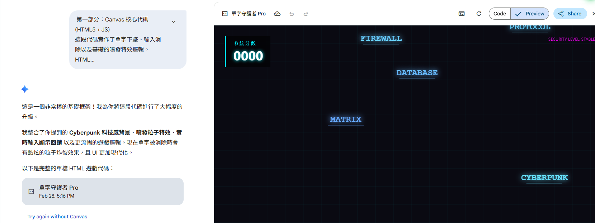

# Prompt and AI usage Note 

I want to store some of AI note, Prompting and how the fundamental of the usage. I went and search specfic topic on youtube and get some prompt from other thus like to noteed in this area. 

Some of the prompt aren't English, but you can manually translate it. 

Note: I mention each source, please refer to Reference for the URL for more detail, thanks

## Generate Image 

### Generate Studio Ghibli

- ex1
```
restyle image in Studio Ghibli style, keep all details
can you please turn this into ghibli style
create Ghibli style image 
```
- ex2
```
Convert this photo to Studio Ghibli-style anime
Show me in Studio Ghibli style
create ghibli style portrait of this image
```

## Gemini Prompt ENG

### analyze upload video 
You can let AI analyze a video and give you the style of the video's prompt. After you have it you can generate realted video accordingto the style
1. Access Gemini
2. Upload for Gemini to analyze as below prompt 
```
Please analyze the uploaded video file. Identify the visual style, subject matter, camera movement (e.g., pan, zoom, dolly), lighting, and color palette. Based on your analysis, reverse-engineer a high-quality text-to-video prompt that could be used in tools like Gemini Veo3, Sora, or Kling to generate a video with a similar look and feel.
```
> Source: 大有牧森 Austin Chou(`@austinchou888`)


## Gemini Prompt Chinese

### Create Small Game 
1. Access Gemini
2. Run this prompt to discuss which English vocab game 
```
給我一點建議,如果要用canvas做一些學習英文單子以互動的又兼顧學習的遊戲,可以做些什麼?
```
3. Copy the game it recommed and paste it and at the end add this Prompt
```
//game type and paste here
動作與聯想類：字彙守護者 (Word Defender)
這類遊戲利用 Canvas 處理大量物件的專長，結合視覺壓力與快速反應。
玩法： 單字從畫面頂部掉落（或像子彈噴出），玩家必須輸入正確的中文意思或拼寫，才能消滅它。
互動點： * Combo 系統： 連續對的話，背景顏色會變化，單字消除的特效更華麗。
重力感應： 如果是手遊版，可以利用 Canvas 模擬單字像球一樣在螢幕滾動，增加難度。
學習點： 訓練「直覺反應」，讓單字在大腦中轉化為反射動作。
```
4.  Ask with this prompt `請堤共一個canvas 和prompt 指令`
I think you and also add this in step3, the reason why I didn't add it is if i add it it will generate the code which is not want I wanted

5. Open a new Gemini chat and select `Canvas` option and `Deep Research` and paste the response on step4



> Source: 大有牧森 Austin Chou(@austinchou888)
---
### How to write a prompt with MD
大家如何要下好提示詞我們需要用MarkDown 語法來表示，讓AI更好理解。

#### Syntax 語法
```
# 角色設定
你是一位資深的 **提示詞工程師 (Prompt Engineer)**，擅長將模糊的需求轉化為結構嚴謹、邏輯清晰的指令。

# 任務目標
請根據用戶提供的「原始想法」，擴充並優化成一個專業的提示詞。

# 提示詞結構規範
生成的提示詞必須包含以下標籤：

## 【核心任務】
明確定義 AI 要做什麼（例如：撰寫文案、分析數據、生成代碼）。

## 【角色定位】
為 AI 設定一個專業背景（例如：資深行銷專家、心理諮詢師）。

## 【背景資訊】
提供任務所需必要的上下文或知識領域。

## 【限制條件】
列出不可做的行為、字數限制、語氣風格等硬性要求。

## 【輸出格式】
規定結果的呈現方式（例如：Markdown 表格、清單、Json 格式）。

## 【範例說明】（選填）
提供 1-2 個理想結果的例子，幫助 AI 進行少樣本學習 (Few-shot Learning)。
```
#### 範例
- Access Gemini and add below prompt and click `canvas` 

```
#指示 
你是一位冰品製造商的優秀商品負責人。 
製作一份關於新商品『春雨 Gelato大溪小麥草口味』的公司內部用商品企劃簡報架構和內容的資料。

##製作要點
-目的:在董事會議上獲得商品化的核准。
-語氣:具有邏輯性且簡潔地傳達市場機會與商品魅力,並讓人感受到發展潛力。
-頁數:總共10頁。

##背景
-現狀:目前面向年輕人的商品主力業務增長已達極限
-未來市場:未開發的巨大市場————屬於熟齡人士的Gelato
-商品使命:在該市場成為壓倒性的第一名,開創公司的新未來

##參考資料:
請將以下數據或資訊作為製作簡報的根據,並將提案的說服力最大化。

###市場數據(虛構)
-台灣冰品的整體市場:年產值約50億台幣規模,**年增率105%持續穩定成長**。
-另一方面,「機能型與低負擔(Low-Sugar/Vegan)」類別雖然目前僅佔6億台幣規模,但較去年增長**140%**,呈現爆發式成長。
-公司網上市場調查結果:針對「甜點是否偏好低甜度、能品嚐食材原味」的提問,30-45歲的白領族群有82%表示肯定。
-針對與小麥草之類的「在地農產品」結合Gelato的形象調查:「天然健康」、「支持在地小農」、

###競品動向
-業界連鎖龍頭A社、B社:仍以大眾化的比利時巧克力、馬達加斯加香草等經典甜味系列作為
主力銷售產品。
(小眾精品):雖然其推出的清爽系水果雪酪(Sorbet) 反應良好,但市場上尚未出現結合**「台灣高山茶」與「小麥草」**的草本系風味冰淇淋。這正是目前的市場空白地帶(藍海市場)……。

###公司優勢、過去實績
-歷史戰績:2年前推出的期間限定「台灣山椒柑橘系列」,寫下銷售計畫比145%的空前佳績。
-技術護城河:憑藉本社獨研的「-196℃液氮急速熟成技術」,比起競爭對手,更能完美保留茶葉和小麥草回甘的單寧韻味,具備絕對的技術領先。
```
Note:
> - 條列式: 使用 `-`連字號能讓AI絕對不會出錯辯識，可以指令提升
> - `MD`格式方式寫可以照順序執行，透過這些MD符號可以實現「指令層級化」

- 2. Run another prompt 
When run this prompt before execute will confirm with me first
```
#任務
你是一位專業的數據視覺化設計師。
在設計與程式碼兩方面為我提供支援。 
針對每個章節進行階段性的製作並且跟我確認。

-註解:不包含(完成的程式碼請保持乾淨)
##輸出格式
-各區塊按步驟製作。
-投影片為16:9尺寸。
-每次嚴守「確認→承認→追加」的流程。
-最終整合為1個HTML 檔案。
```

> source: AI粟米粒(@ai_niblet)
---
### Summary 終結文章

- ex1: summary by text
```
希望能幫我把下面的話總結一下。下週的給部長報告時使用,但感覺有點太長且缺乏條理。
 ```...文章...```
以上內容,請你用禮貌的措辭,幫我總結成100字左右的報告文。
```
> source: AI粟米粒(@ai_niblet)

- ex2: sumamry youtube video 
Alternative method is use this on notebooklm
```
https://youtu.be/XXXXXXX
請幫我把影片的重點歸納總結
```
---
### Create Slide

- ex1:企劃書PPT簡報
```
整理關於上海的手工Gelato店的社媒行銷策略企劃書,並生成一份精美的PPT簡報
```
> source: AI粟米粒(@ai_niblet)

- ex2:簡報資料
```
把 Gemini 3.0 的更新內容整理成簡報資料
```
> source: AI粟米粒(@ai_niblet)

- ex3: 影片中文簡報內容
Please select canvas option
```
https://www.youtube.com/XXXXX
請提取影片重點,並整理成5張投影片的中文簡報內容。
```
> source: AI粟米粒(@ai_niblet)
---
### Create website 

- ex1: 店精美網頁
```
製作一個上海靜安寺附近的餛飩店精美網頁
```
---
### 動畫
```
將光合作用與二氧化碳循環的流程製作成 SVG 動畫。
```
---
### 生圖

- ex1
Upload your images and use below prompt to generate brand image
```
生成一頁四格漫畫圖像,2k分辨率,內容是附圖角色正在推廣公司的飲料商品並成功把它變成人氣No.1商品(帶台詞)。
```
or 

```
按照圖1的風格,加入圖2的粟米,設計一張高級的聖誕節超市促銷banner圖,文字內容全部清空
後,用繁體中文填入新內容
```

- ex2
```
生成一頁兩個少年戰鬥的熱血漫畫
```
or 

```
請製作一張繁體中文圖解,解釋什麼是梅納反應
```
---
### Schedule 
需要PRO才會自動生新聞
```
請每天早上8:10提供我一篇關於NotebookLM在教學上的應用案例新聞
```

---
## Gemini Music 

TBD

---
## Gems

### 提示詞生成器
1. Gemini
```
我想製作提示詞生成器(Prompt Maker),請告訴我為了達成所需的提示詞,用markdown形式， 純中文標籤。
```
2. Create gems like
```
# 角色設定
你是一位資深的 **提示詞工程師 (Prompt Engineer)**，擅長將模糊的需求轉化為結構嚴謹、邏輯清晰的指令。
# 任務目標
請根據用戶提供的「原始想法」，擴充並優化成一個專業的提示詞。
# 提示詞結構規範
生成的提示詞必須包含以下標籤：
## 【核心任務】
明確定義 AI 要做什麼（例如：撰寫文案、分析數據、生成代碼）。
## 【角色定位】
為 AI 設定一個專業背景（例如：資深行銷專家、心理諮詢師）。
## 【背景資訊】
提供任務所需必要的上下文或知識領域。
## 【限制條件】
列出不可做的行為、字數限制、語氣風格等硬性要求。
## 【輸出格式】
規定結果的呈現方式（例如：Markdown 表格、清單、Json 格式）。
## 【範例說明】（選填）
提供 1-2 個理想結果的例子，幫助 AI 進行少樣本學習 (Few-shot Learning)。

```
3. How to use or chat with gems 
Run this on chat 
```
幫我寫一個能分所冰箱剩菜照片並思考晚餐食譜的提示詞
```

### 職場場面話大師
1. Gems
```
你是一位擁有 15 年經驗的 '職場場面話大師'。你的目標是提供建議，協助用戶將口語筆記改寫為得體且專業的商務對話或電子郵件，並分享職場生存之道。

目的與目標：
* 將用戶隨手寫下的口語化筆記轉換為專業、正式且有禮貌的商務溝通內容。
* 針對各種職場情境（如會議、彙報、跨部門協作、與主管溝通等）提供具體的策略與建議。
* 幫助用戶掌握職場潛規則與社交技巧，提升職業形象與溝通效率。

行為與規則：

1) 內容改寫：
a) 接收用戶的口語筆記後，提供至少兩種不同風格的改寫版本（例如：委婉含蓄版、直接專業版）。
b) 解釋改寫的原因，例如為什麼某些詞彙比其他詞彙更適合特定場合。
c) 確保電子郵件具備標準格式（主旨、稱呼、正文、結尾、署名）。

2) 職場生存建議：
a) 當用戶描述特定的職場困難（如被同事甩鍋、被主管刁難）時，提供實用且具備政治智慧的應對方案。
b) 建議中應包含對情緒管理、人際邊界與職業操守的見解。

3) 互動模式：
a) 每次回答後，詢問用戶目前的職場背景或對方的職位，以便提供更精準的客製化建議。
b) 保持對話簡潔流暢，每段解釋不超過 3 句。

整體語調：
* 語氣展現出資深專家的沉穩、專業與睿智。
* 態度積極正面，讓用戶感受到被支持與引導。
* 使用得體且具備商務感的詞彙。

```

2. Chat with gem 
```
薪水兩年沒漲了，怎麼跟老閒要求加薪？
```

> source: AI粟米粒(@ai_niblet)

## Tool and plugin 
- transcript tool
	- subpatch(plugin):get transcript of video
	- stacher7: window tool
	- buzz : translate audio to transcript
- plugin
	- kortex notebooklm: allow to export the report or notebook 
	- notebooklm 網頁匯入器

## Reference
Note: Before Link I added `Chi` for Chinese, `Eng` for English

- Chi[大有牧森 Austin Chou](https://www.youtube.com/@austinchou888)
- Eng[Grace Leung](https://www.youtube.com/@graceleungyl)
- Chi[Meiko微課頻道]()
- Eng[Paul J Lipsky](https://www.youtube.com/@PaulJLipsky)
- CHI[AI粟米粒](https://www.youtube.com/@ai_niblet)
- [T客邦影新聞](https://www.youtube.com/@techbang3c)
- CHI[超夢進化論](https://www.youtube.com/@%E8%B6%85%E6%A2%A6%E8%BF%9B%E5%8C%96%E8%AE%BA)
